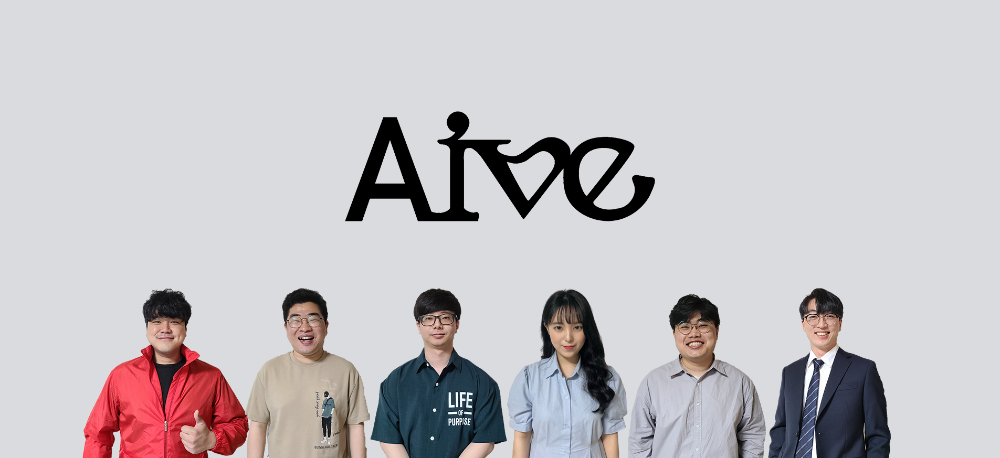

# AATS

> __정신없조(D102)__  
강모현, 박성환, 박재현, 양서정, 이병수, 최종현

> __개발 기간__: 2023.02.20 ~ 2023.04.07 (약 7주) 

 

## 팀원 역할
| 이름   | 역할 | 내용                        |
| ------ | ---- | --------------------------- |
| 강모현 | AI | AI 개발 |
| 박성환 | BE | 백앤드 개발,  CI/CD |
| 박재현 | BE | 백앤드 개발, JWT 관리, 이미지 업로드 |
| 최종현 | BE | 백앤드 개발, REST API |
| 양서정 | FE | 프론트엔드 개발, UI/UX 디자인 |
| 이병수 | FE | 프론트엔드 개발, 비동기 통신 |

 

### UCC ➡ [유튜브](https://www.youtube.com/watch?v=NyFY9B5sgGI&t=129s)
### 발표자료 ➡ [중간 발표자료](docs/pdf/중간발표.pdf) / [최종 발표자료](docs/pdf/최종발표.pdf)
### Notion ➡ [노션](https://www.notion.so/TEAM-D102-78c7a75d883a470989ff1ed556976ead)

 

---

 

## 기획 배경 및 목표
### 카드를 이용한 출입 시스템의 불편함
> 카드가 없으면 출입이 불가능한 시스템 구조상 카드를 항상 소지하여야하고, 카드를 꺼내어 태깅을 해야함
또한 건물 출입 후 별도로 출근 프로세스를 진행하는 부분에 있어 불필요한 중복업무가 발생
* 이를 AI 영상분석을 통한 실시간 객체검출을 통해 출입과 동시에 출근, 퇴근시각으로 기록하여 편리한 입출입 서비스 제공

 

## 기술 스택 & 아키텍쳐
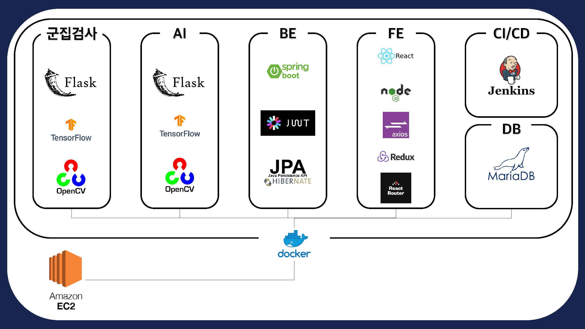
 
 

### Front-End

	
	
	
    
	

### Back-end

	
	
    
	
    
	
	

### AI

	
	
	
	

### TEAM Cooperation

	
	
    
	
	

 

---

 

## 서비스 소개

* AI 영상 분석을 통한 실시간 객체 검출을 통해 실시간 출퇴근 기록 서비스 제공
* SSD MobileNet를 이용하여 약 200,000번 학습된 데이터를 openCV로 IP Camera와 연동하여 학습된 모델 적용 및 객체 검출
* 인식된 Class Name으로 DB에 접근하여 출입과 동시에 DB에 출석 요청을 발송
* DB에 기록된 출결 현황 및 시간을 웹페이지에서 실시간으로 조회

 

## 시나리오

### 회원가입/ 로그인 선택

#### 회원가입

	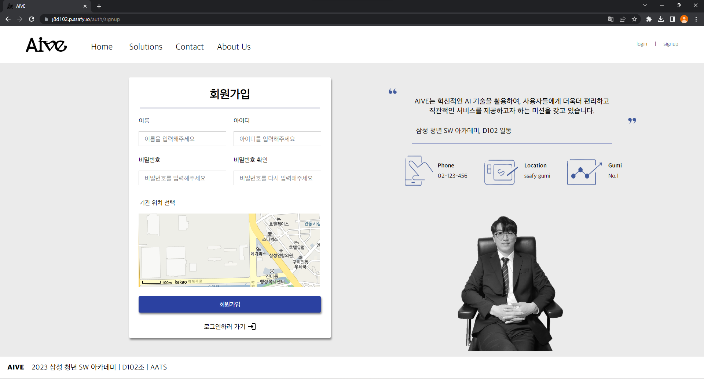

#### 로그인 선택

	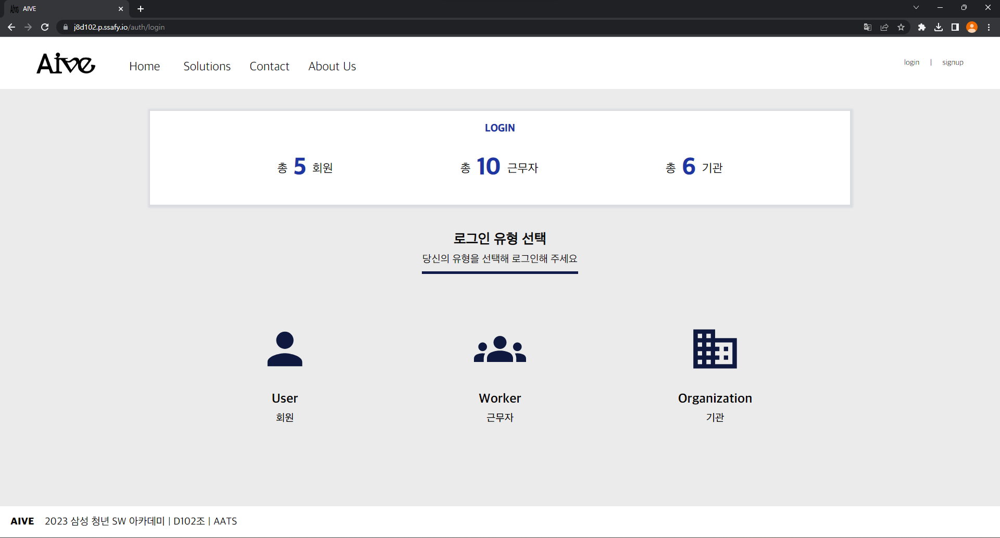

### Organization

#### 로그인

	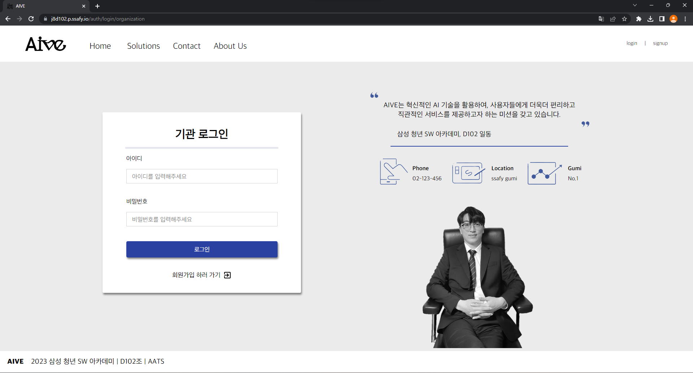
	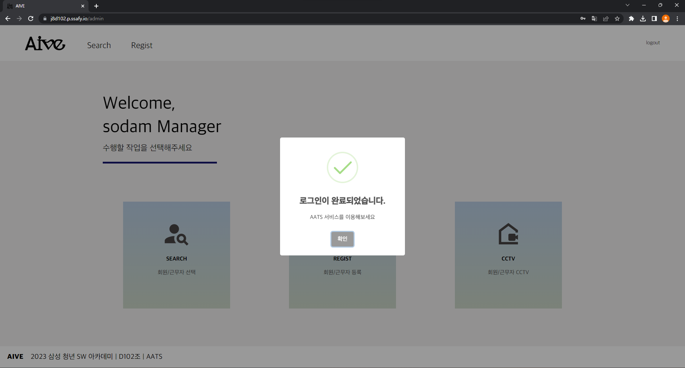

#### 회원/근무자 조회

	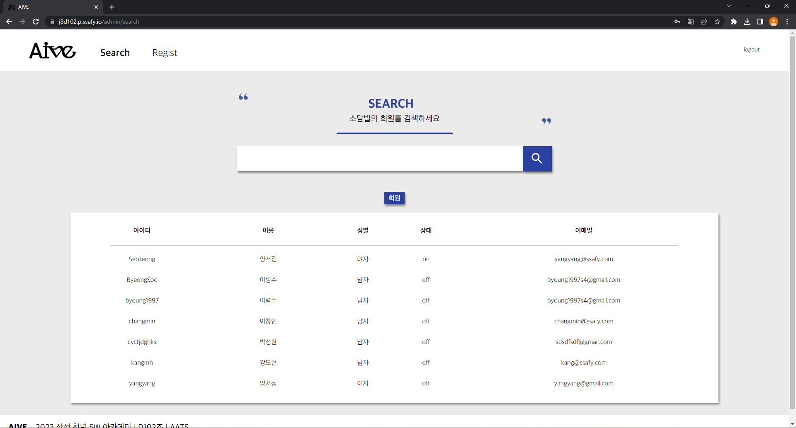
	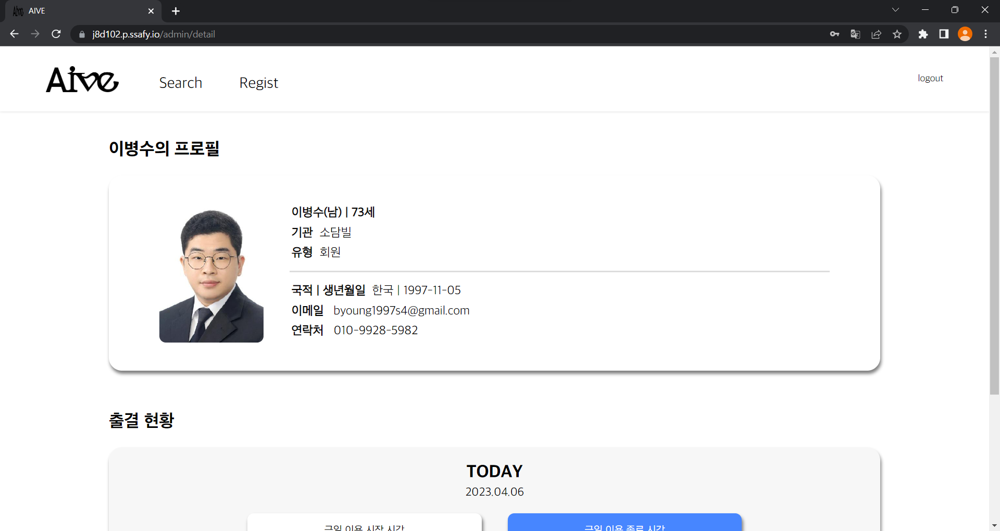

#### 회원/근무자 등록

	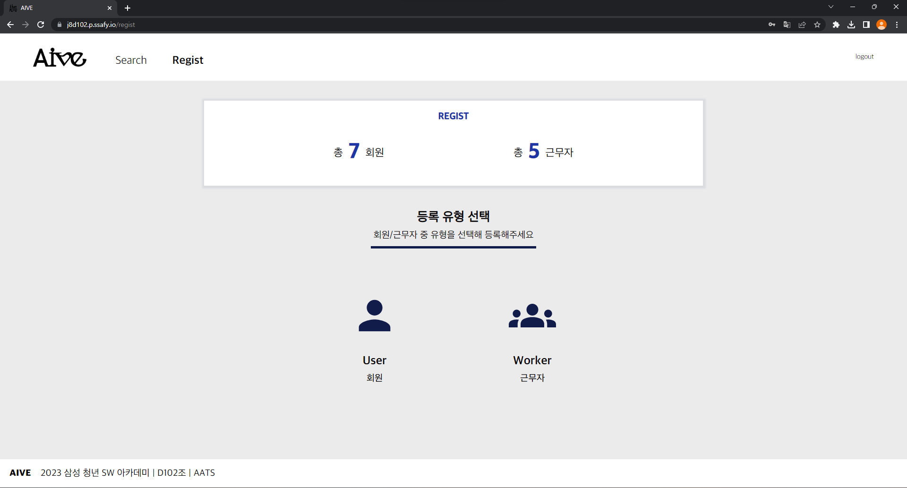
	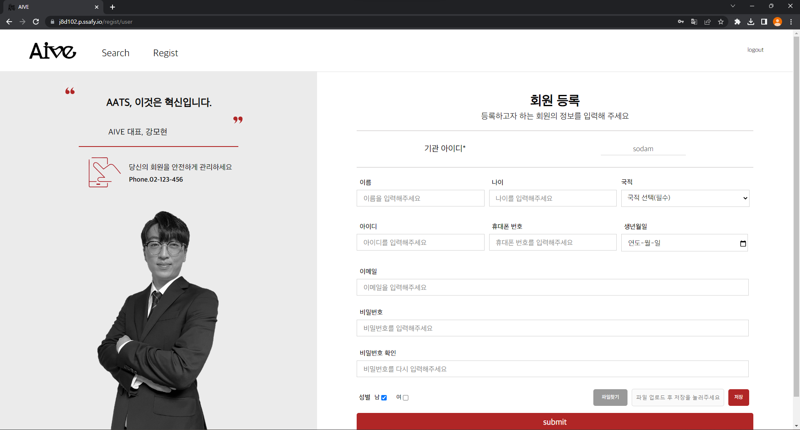

#### 회원/근무자 출퇴근

	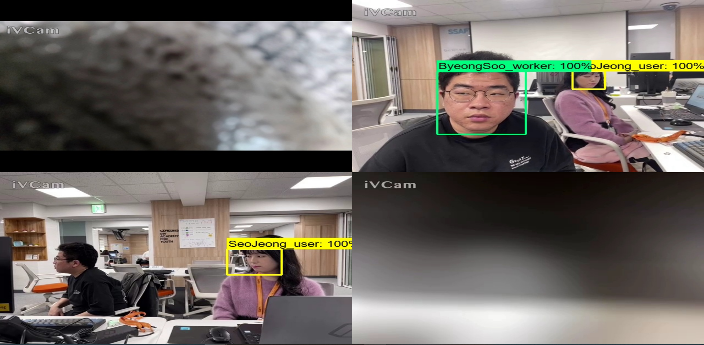

#### 군집도 확인

	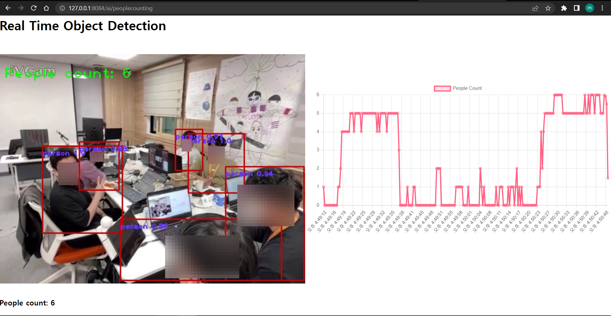

### User

#### 로그인

	

#### 정보조회

	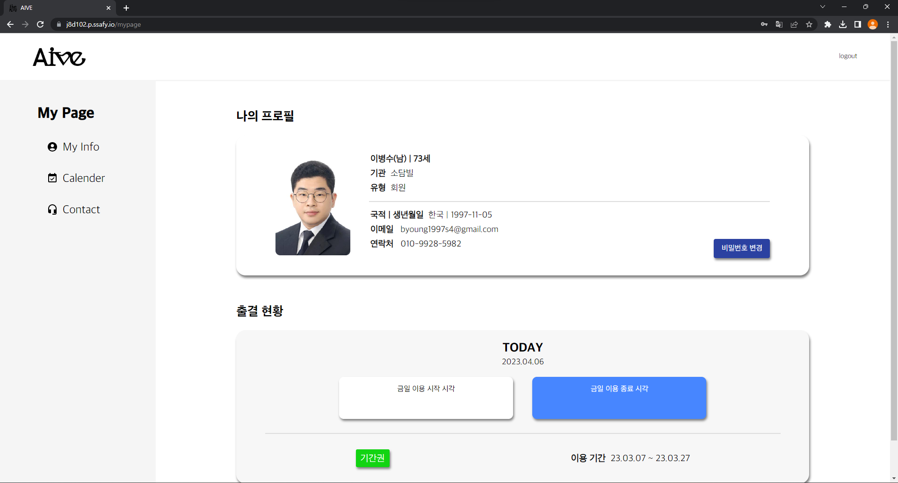

#### 달력확인

	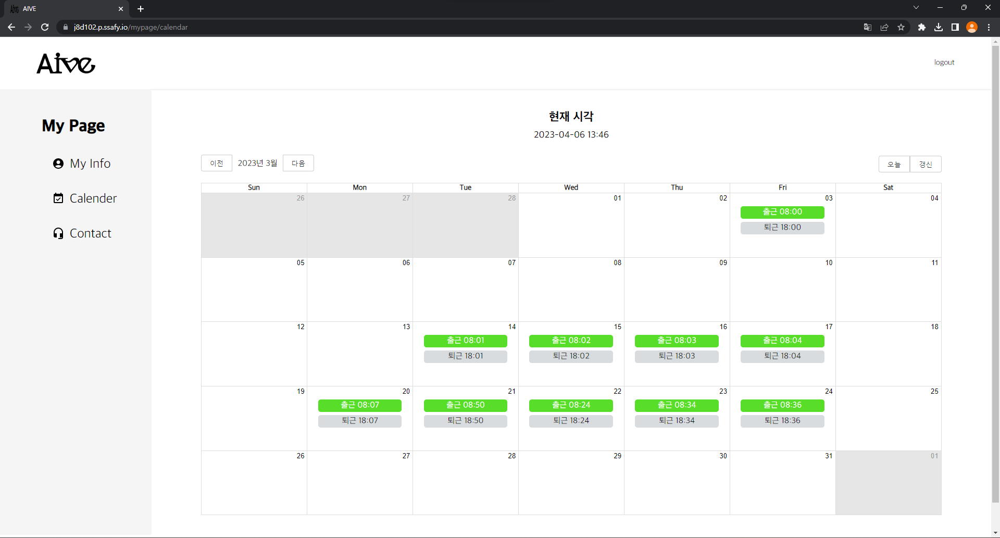

### User

#### 로그인

	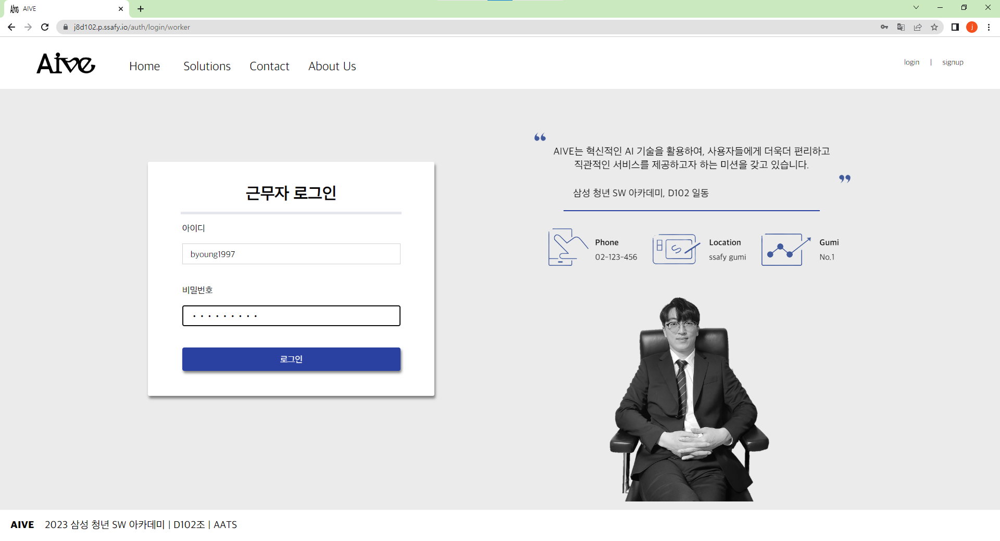

#### 정보조회

	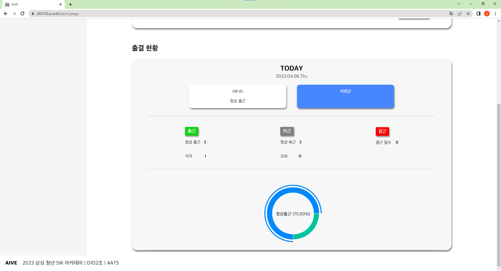

#### 달력확인

	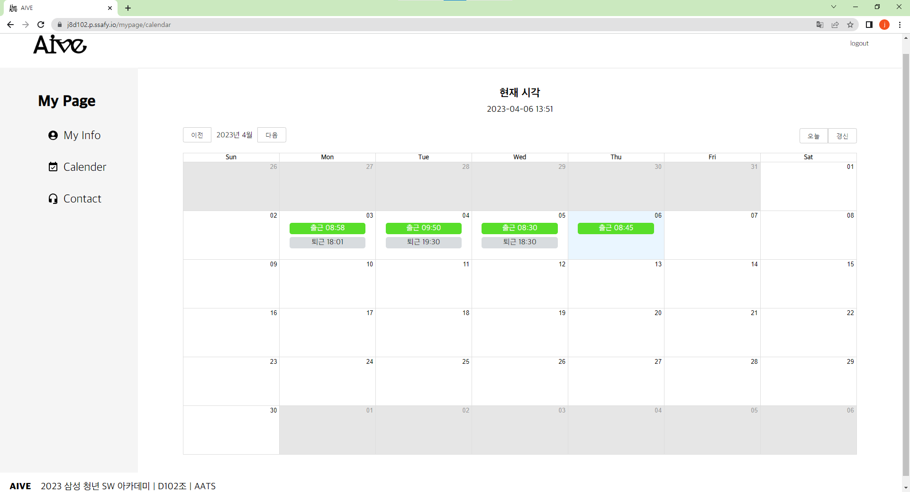

##### 상세 시연 시나리오 ➡ [노션 링크](https://www.notion.so/AATS-Automatic-Attendance-and-Tracking-System-661bda09195e4f3f9bbf02a71ba8959d)

 

---

 

## DB ERD
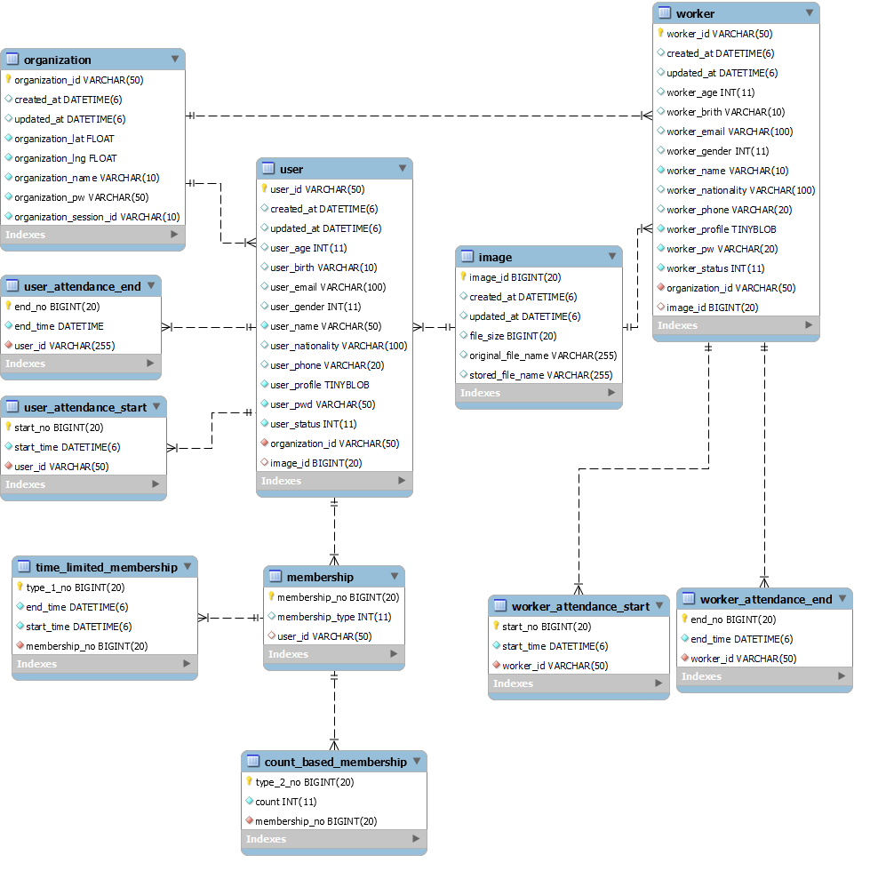

