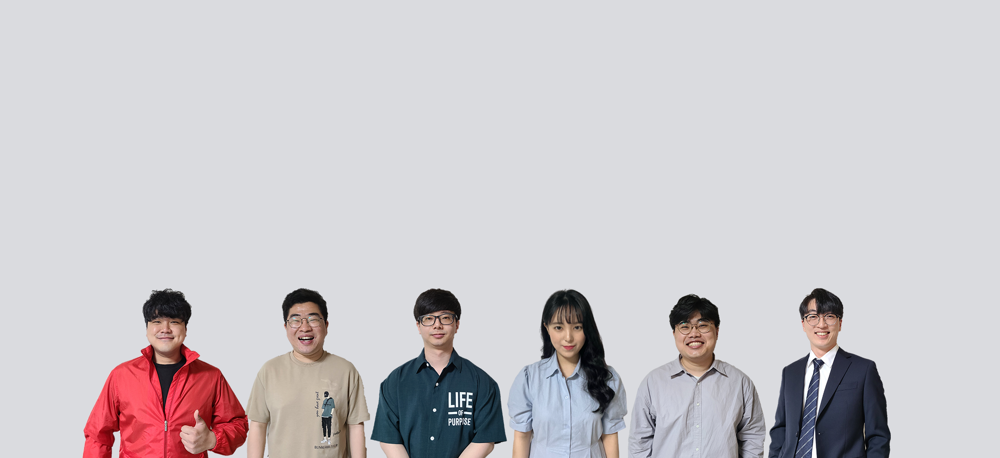

# AATS

> __정신없조(D102)__  
강모현, 박성환, 박재현, 양서정, 이병수, 최종현

> __개발 기간__: 2023.02.20 ~ 2023.04.07 (약 7주) 

 

### UCC ➡ [유튜브 링크](https://www.youtube.com/watch?v=NyFY9B5sgGI&t=129s)
### 발표자료 ➡ [최종 발표자료 링크](...)
### Notion ➡ [노션 링크](https://www.notion.so/TEAM-D102-78c7a75d883a470989ff1ed556976ead)

 

---

 

## 기획 배경 및 목표
블라블라

## 기대 효과
블라블라

 

## 기술 스택 & 아키텍쳐

 
 

### Front-End

	
	
	
    
	

### Back-end

	
	
    
	
    
	

### TEAM Cooperation

	
	
    
	

 

---

 

## 서비스 소개
블라블라

 

## 주요 기능
- 

 

## 시나리오
대략적 시나리오 그림 + 약간의 설명
##### 시연 시나리오 ➡ [노션 링크](https://www.notion.so/AATS-Automatic-Attendance-and-Tracking-System-661bda09195e4f3f9bbf02a71ba8959d)

 

---

 

## DB ERD

## 팀원 역할
| 이름   | 역할 | 내용                        |
| ------ | ---- | --------------------------- |
| 강모현 | AI | 프론트엔드 개발 |
| 박성환 | BE | 백앤드 개발,  CI/CD |
| 박재현 | BE | 백앤드 개발, JWT 관리, 이미지 업로드 |
| 최종현 | BE | 백앤드 개발, REST API |
| 양서정 | FE | 프론트엔드 개발, UI/UX 디자인 |
| 이병수 | FE | 프론트엔드 개발, 비동기 통신 |
